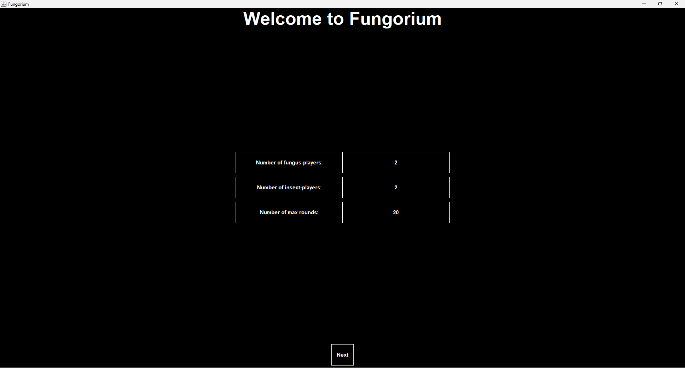
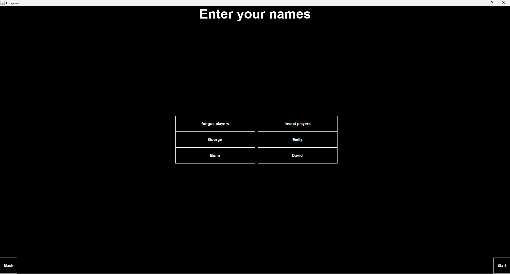
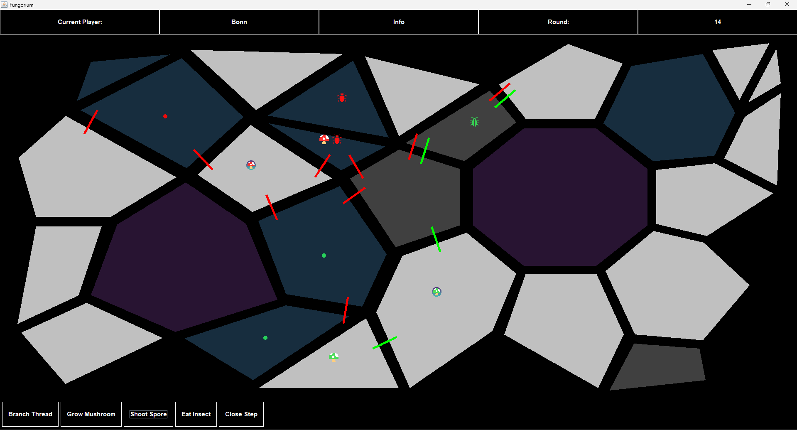

# Fungorium – Game Project

## Team Members

This project was developed collaboratively with a team of five students:

- Fejes Ábel
- Lekli Zsolt	
- Szolár Soma
- Toronyi Zsombor
- Zelch Csaba	

Note: This is a collaborative project completed together with four other classmates as part of the Software Project Laboratory course at Budapest University of Technology and Economics.

## Project Description

Fungorium is a strategic game where players take on one of two roles: Mushroom Grower or Insect Hunter. The goal is to manage mushroom growth, distribute spores, and control insect movement and filament cutting.

Main Game Elements

Tectons: The game board consists of convex polygons. Tectons differ in color and functionality:

- Some absorb filaments over time.

- Some allow multiple mushroom filaments to cross.

- Some allow only one filament to grow.

- Some allow filaments to grow but prevent mushroom body development.

Mushroom Growers:

- Control the growth direction of mushroom filaments.

- Initiate spore dispersal.

- Grow new mushroom bodies if there are enough spores.

- They can eat insects if the insect is in paralyzed state.

- Each mushroom body produces spores every even-numbered round. Spores can be launched to neighboring or second-neighboring tectons, depending on the maturity of the mushroom body.

Insect Hunters:

- Control insect movement between tectons.

- Cut filaments connecting tectons from the current insect’s position.

- Insects consume spores, which affect them differently (speed up, slow down, paralyze, or prevent filament cutting).

Tecton Breakage:

- Every 4th round, a tecton may break.

- Tectons with only three vertices or with a mushroom body cannot break.

Game Flow

On the start screen, select the number of Mushroom Growers and Insect Hunters.

Enter player names (first Mushroom Growers, then Insect Hunters).

The game proceeds in rounds: Mushroom Growers act first, followed by Insect Hunters.

After a fixed number of rounds, the game ends. Winners are determined by the number of developed mushroom bodies and the number of spores collected.

## Demo

Initialization window



Here you add the names of the players



The game window 



Leaderboard


## Installation & Running 

Clone the repository:
```bash
git clone https://github.com/zelchcsaba/szoftver_projekt_laboratorium.git
cd szoftver_projekt_laboratorium
```
Open the run.bat file.
